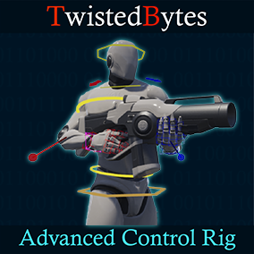
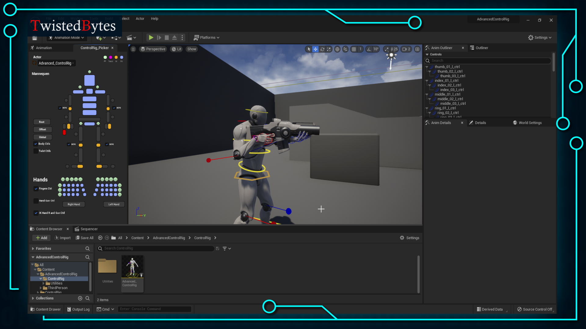
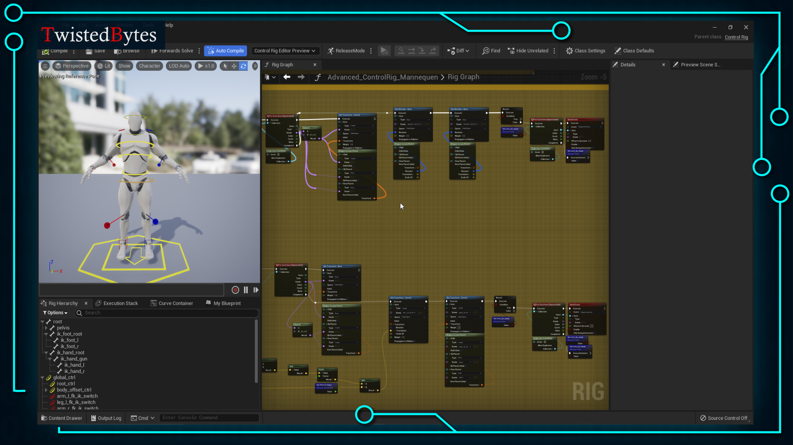
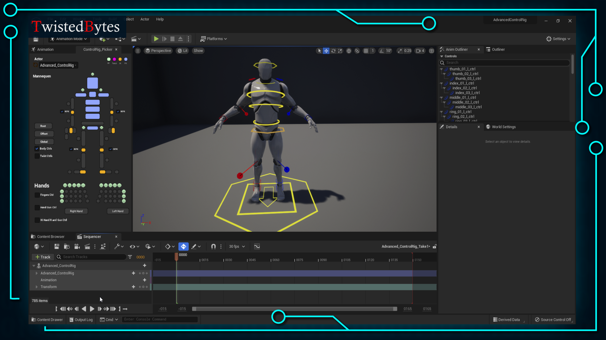
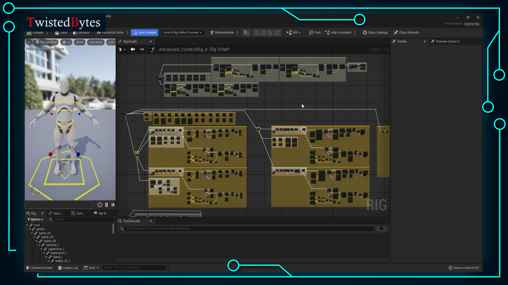

# TwistedBytes Control Rig

# Description

📺 [Trailer](https://youtu.be/npszioSXJ0Y)

🛰 [Discord](https://discord.twistedbytes.net/)

**TwistedBytes Control Rig** is a sample project for Unreal Engine 5 that aims to help in learning how to make animations and to rig characters using Unreal Engine's [Control Rig](https://docs.unrealengine.com/5.0/en-US/control-rig-in-unreal-engine/) plugin.

Using **TwistedBytes Control Rig** in _Sequencer_ will allow you to create game-ready animations completely in UE5.

# Technical Details

Features:

-   Full Control Rig for the UE4 Mannequin.
-   IK-FK Switch.
-   Helper Utility Widget for Controls.

Scaled to Epic skeleton: Yes

Rigged: Yes

Animated: Yes

# Demo Project

This sample project demonstrates a Control Rig for Unreal Engine 4's default mannequin.

